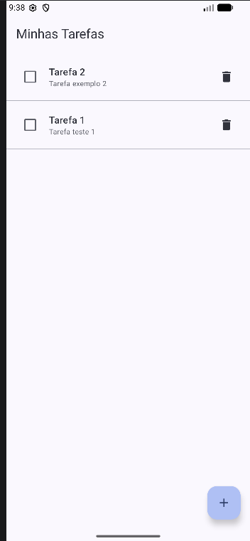
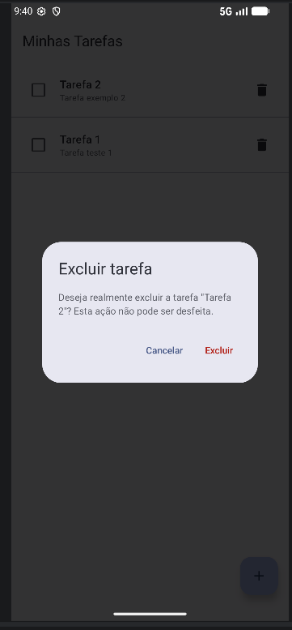
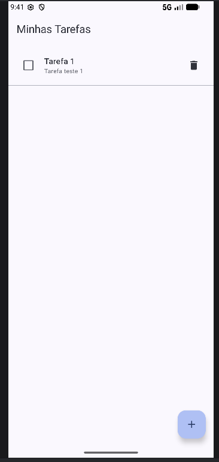
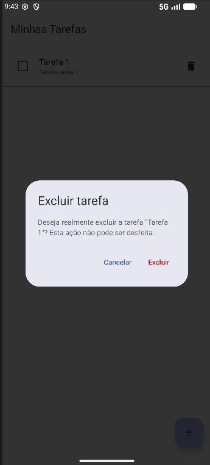
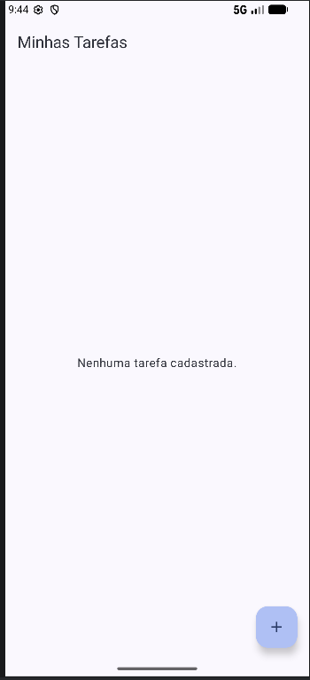

# Evidências - Confirmação de Exclusão de Tarefas

Evidências de execução da funcionalidade de confirmação de exclusão segura com Jetpack Compose e Material 3.

---

### 1. Lista antes da exclusão
Exibição da lista de tarefas cadastradas antes de acionar a ação de exclusão.

---

### 2. Diálogo aberto com a tarefa selecionada
Diálogo de confirmação aberto sobre a tela atual, indicando o título da tarefa específica escolhida.

---

### 3. Resultado ao cancelar
Após clicar no botão "Cancelar", o diálogo fecha e nenhuma tarefa é removida da lista.

---

### 4. Nova abertura do diálogo
Reabertura do diálogo de confirmação para exclusão definitiva.

---

### 5. Resultado após confirmar a exclusão
Após clicar em "Excluir", apenas a tarefa selecionada é removida do Room e a tela é atualizada.
